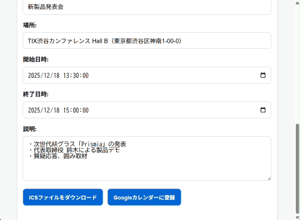

# CalDAV Calendar Event Generator

AI駆動のカレンダーイベント生成ツール。メール文面から予定情報を自動抽出し、ICSファイル生成やGoogleカレンダーへの直接登録ができます。

## 📖 概要

### 背景と課題

メールで受け取った予定を手動でカレンダーに入力するのは時間がかかり、ミスも発生しやすい作業です。特に：

- 日時や場所を読み取って、正確に入力する手間
- 年が省略されている場合の推測ミス
- 複数のカレンダーアプリに対応する煩雑さ

このツールは、OpenAI GPTの力を借りて、メール本文から予定情報を自動抽出し、ワンクリックでカレンダーに登録できるようにします。

### 主な機能

- 📧 **AIによる自動解析**: メール本文から予定情報（タイトル、日時、場所、説明）を抽出
- 🗓️ **賢い年次推測**: 年が省略されている場合、現在日付を基準に最も近い未来の日付を推測
- 📅 **ICSファイル生成**: 標準的なiCalendar形式でエクスポート（Outlook、Apple Calendar等に対応）
- 🔗 **Googleカレンダー連携**: OAuth認証を通じて直接カレンダーに登録
- 🔒 **セキュアな実装**: セッション管理、HTTPS、XSS対策など、本番運用を考慮した設計

## 💡 使い方デモ



### 実際のメール例

以下のようなメール文面を貼り付けるだけで、予定情報を自動抽出します：

```
件名: プロジェクトキックオフミーティング

12月25日（水）14:00から、本社会議室Aにて
新プロジェクトのキックオフミーティングを開催します。

参加必須です。よろしくお願いします。
```

### 解析結果

| 項目 | 抽出された値 |
|------|------------|
| タイトル | プロジェクトキックオフミーティング |
| 場所 | 本社会議室A |
| 開始日時 | 2025-12-25T14:00:00 |
| 終了日時 | 2025-12-25T15:00:00 *(自動計算)* |
| 説明 | 参加必須です。よろしくお願いします。 |

**年次推測の例:**
- 現在が2025年11月の場合、「12月25日」→ `2025年12月25日`
- 現在が2025年11月の場合、「1月15日」→ `2026年1月15日` *(未来の日付として推測)*

### 使い方の流れ

1. **Googleアカウントと連携** - OAuth認証でログイン
2. **メール内容を貼り付け** - テキストエリアにコピペ
3. **GPTで解析** - ボタンをクリックして自動抽出
4. **結果を確認・編集** - 必要に応じて修正
5. **登録** - ICSダウンロードまたはGoogleカレンダーに直接登録

## 🔧 技術的特徴

### 1. GPT Function Calling による構造化データ抽出

従来のプロンプトベースではなく、OpenAIのFunction Calling機能を使用して、予定情報を確実にJSON形式で取得します。

```javascript
{
  "title": "...",
  "location": "...",
  "startTime": "2025-12-25T14:00:00",  // ISO 8601形式
  "endTime": "2025-12-25T15:00:00"
}
```

### 2. 動的な年次推測

システムプロンプトに現在の日付とロジックを埋め込み、GPTに年の推測をさせます：

```
現在の日付: 2025年11月24日

重要な指示:
- メール本文に年が書かれていない場合は、現在の日付を基準に、
  最も近い未来の日付を推測してください
- 例: 現在が11月で、メールに「12月25日」→ 2025年12月25日
- 例: 現在が11月で、メールに「1月15日」→ 2026年1月15日
```

### 3. セキュリティ実装

- **セッション管理**: HttpOnly/Secure/SameSite属性でXSS・CSRF対策
- **環境変数化**: 機密情報は`.env`で管理、ハードコード一切なし
- **エラーハンドリング**: 本番環境では詳細なエラーを隠蔽、開発環境のみ表示
- **API制限**: OpenAI APIに30秒タイムアウトを設定

### 4. Cloud Run対応

- Dockerコンテナ化
- ステートレスなセッション管理（将来的にFirestore等に対応可能）
- 動的ポート対応（`process.env.PORT`）

## 🛠️ 技術スタック

- **Backend**: Node.js 18+, Express.js
- **AI**: OpenAI GPT-3.5-turbo (Function Calling)
- **認証**: Google OAuth 2.0, Google Identity Services
- **Calendar**: Google Calendar API, iCalendar (ICS形式)
- **Frontend**: Vanilla JavaScript（シンプルな実装）
- **Infrastructure**: Google Cloud Run, Docker

## 📦 セットアップ

### 前提条件

- Node.js 18.0.0以上
- npm
- Google Cloud アカウント（[無料枠あり](https://cloud.google.com/free)）
- OpenAI APIアカウント（[取得はこちら](https://platform.openai.com/)）

### 1. リポジトリのクローンと依存関係のインストール

```bash
git clone https://github.com/yourusername/caldav-calendar-generator.git
cd caldav-calendar-generator
npm install
```

### 2. 環境変数の設定

`.env.example`をコピーして`.env`を作成します：

```bash
cp .env.example .env
```

`.env`ファイルを編集して、以下を設定：

```bash
# OpenAI API Key (https://platform.openai.com/ で取得)
OPENAI_API_KEY=sk-proj-xxxxxxxxxxxxx

# Google OAuth認証情報 (https://console.cloud.google.com/ で取得)
GOOGLE_CLIENT_ID=xxxxx.apps.googleusercontent.com
GOOGLE_CLIENT_SECRET=GOCSPX-xxxxxxxxxxxxx
GOOGLE_REDIRECT_URI=http://localhost:8080/auth/google/callback

# セッションシークレット（32文字以上のランダムな文字列を推奨）
SESSION_SECRET=your-very-long-random-string-here

# 本番環境のホスト名（オプション）
# 本番環境で動的リダイレクトURIを使用する場合に設定
# PRODUCTION_HOST=calendar.example.net

# CORS許可オリジン（カンマ区切り）
CORS_ORIGINS=http://localhost:8080

# サーバーポート（オプション）
PORT=8080
```

**Google OAuth認証情報の取得方法:**
1. [Google Cloud Console](https://console.cloud.google.com/)でプロジェクトを作成
2. 「APIとサービス」→「OAuth同意画面」を設定
3. 「認証情報」→「認証情報を作成」→「OAuth 2.0クライアントID」
4. 「承認済みのリダイレクトURI」に以下を追加:
   - ローカル: `http://localhost:8080/auth/google/callback`
   - 本番: `https://your-domain.com/auth/google/callback`

### 3. アプリケーションの起動

```bash
npm start
```

ブラウザで `http://localhost:8080` にアクセスして動作確認。

## 🚀 デプロイ

### Google Cloud Runへのデプロイ

#### 前提条件

- [Google Cloud SDK](https://cloud.google.com/sdk/docs/install)がインストール済み
- Google Cloudプロジェクトが作成済み
- Billing（課金）が有効化されている

#### デプロイスクリプトを使用（推奨）

**Windows (PowerShell):**

```powershell
.\deploy-cloud-run.ps1 -ProjectId "YOUR_PROJECT_ID" -Region "asia-northeast1" -ServiceName "mail-to-calendar"
```

**Linux/Mac:**

```bash
chmod +x deploy-cloud-run.sh
./deploy-cloud-run.sh YOUR_PROJECT_ID asia-northeast1 mail-to-calendar
```

スクリプトが自動的に：
- `.env`から環境変数を読み込み
- Cloud Runにデプロイ
- 必要な環境変数を設定
- デプロイ後の手順を表示

#### Google Cloud Console での設定

デプロイ後、以下の設定を行ってください：

##### 1. Google Calendar API を有効化

1. [Google Cloud Console](https://console.cloud.google.com/) → 「APIとサービス」→「ライブラリ」
2. 「Google Calendar API」を検索して有効化

##### 2. OAuth 2.0 認証情報の更新

1. 「APIとサービス」→「認証情報」
2. OAuth 2.0クライアントIDを選択
3. 「承認済みのリダイレクトURI」に以下を追加:
   ```
   https://your-service-name-xxxxxxxxxx-xx.x.run.app/auth/google/callback
   ```
   ※ `your-service-name-xxxxxxxxxx-xx.x.run.app` は、デプロイ時に表示されたあなたのサービスURLに置き換えてください

##### 3. Cloud Run の環境変数を確認

Cloud Runコンソールで以下の環境変数が設定されているか確認：

- `OPENAI_API_KEY` ✓
- `GOOGLE_CLIENT_ID` ✓
- `GOOGLE_CLIENT_SECRET` ✓
- `SESSION_SECRET` ✓
- `GOOGLE_REDIRECT_URI` ✓
- `CORS_ORIGINS` ✓

##### 4. 動作確認

デプロイされたURLにアクセスして、以下を確認：

- [ ] トップページが表示される
- [ ] Google OAuth認証が正常に動作する
- [ ] メール解析が動作する
- [ ] Googleカレンダーへの登録が成功する

#### トラブルシューティング

**デプロイが失敗する場合:**
- Cloud Build APIとCloud Run APIが有効になっているか確認
- プロジェクトのBillingが有効か確認
- `.gcloudignore`で必要なファイルが除外されていないか確認

**アプリケーションが起動しない場合:**
- Cloud Runのログを確認:
  ```bash
  gcloud run logs read YOUR_SERVICE_NAME --region=YOUR_REGION
  ```
- 環境変数が正しく設定されているか確認
- `PORT`環境変数はCloud Runが自動設定するため不要

**OAuth認証エラー:**
- リダイレクトURIが正確に一致しているか確認（末尾のスラッシュなど）
- OAuth同意画面が正しく設定されているか確認
- `PRODUCTION_HOST`を設定している場合、ホスト名が正確に一致しているか確認

## 📁 プロジェクト構造

```
.
├── app.js                     # メインアプリケーション（Express サーバー）
├── verify-token.js            # JWT検証モジュール
├── package.json               # 依存関係定義
├── Dockerfile                 # Cloud Run用Dockerイメージ
├── deploy-cloud-run.sh        # デプロイスクリプト（Bash）
├── deploy-cloud-run.ps1       # デプロイスクリプト（PowerShell）
├── .env.example               # 環境変数テンプレート
├── .gitignore                 # Git除外設定
├── .gcloudignore              # Cloud Run除外設定
├── public/
│   └── index.html             # メインUI（カレンダー生成画面）
└── tests/
    └── api.test.js            # APIテスト
```

## 🔌 APIエンドポイント

| エンドポイント | メソッド | 説明 |
|--------------|---------|------|
| `/` | GET | メインUI（要認証） |
| `/api/config` | GET | クライアント設定（Client ID、Service URL） |
| `/api/parse` | POST | メール内容をGPTで解析 |
| `/api/create-ics` | POST | ICSファイルを生成 |
| `/api/google-calendar-create` | POST | Googleカレンダーにイベントを作成（要認証） |
| `/auth/google` | GET | Google OAuth認証フローを開始 |
| `/auth/google/callback` | GET | Google OAuthコールバック |

## 🔒 セキュリティに関する注意

### 環境変数の管理

- `.env`ファイルは**絶対に**コミットしないでください
- 本番環境では強力なセッションシークレットを使用してください（32文字以上のランダムな文字列を推奨）
- `SESSION_SECRET`が未設定の場合、自動的にランダムなシークレットが生成されますが、**本番環境では必ず設定してください**（再起動時にセッションが無効になります）
- APIキーは定期的にローテーションしてください

### 通信のセキュリティ

- HTTPS経由でのみアプリケーションを公開してください
- 本番環境では自動的にセッションクッキーに`Secure`フラグが設定されます
- すべてのセッションクッキーに`HttpOnly`フラグが設定され、XSS攻撃から保護されます
- セッションの有効期限は24時間に設定されています

### API制限

- OpenAI APIは30秒のタイムアウトが設定されています
- レート制限に達した場合、ユーザーフレンドリーなエラーメッセージが表示されます
- Google Calendar APIの認証エラーも日本語で表示されます

## 🐛 トラブルシューティング

### Google OAuth認証エラー

- Google Cloud ConsoleでリダイレクトURIが正しく設定されているか確認
- `GOOGLE_REDIRECT_URI`環境変数が実際のURLと一致しているか確認
- `PRODUCTION_HOST`を設定している場合、ホスト名が正確に一致しているか確認

### GPT解析が失敗する

**エラーメッセージ別の対処法:**

- **「APIの利用制限に達しました」**: OpenAI APIのレート制限に達しています。数分待ってから再試行してください
- **「API設定に問題があります」**: `OPENAI_API_KEY`が無効または未設定です。環境変数を確認してください
- **「AIサービスで一時的な問題が発生しています」**: OpenAI側のサーバーエラーです。しばらく待ってから再試行してください
- **「メール解析中にエラーが発生しました」**: その他のエラーです。開発環境では詳細なエラーメッセージが表示されます

**一般的な確認事項:**
- OpenAI APIキーが有効か確認
- APIの利用上限に達していないか確認
- メール内容に予定情報が含まれているか確認
- APIは30秒でタイムアウトします。非常に長いメール文面の場合は短縮してみてください

### Googleカレンダー登録エラー

**エラーメッセージ別の対処法:**

- **「Google認証されていません」**: OAuth認証が完了していません。「Googleカレンダーと連携する」から認証してください
- **「認証の有効期限が切れました」**: セッションが期限切れです。再度ログインしてください
- **「カレンダーへのアクセス権限がありません」**: OAuth認証時にカレンダーへのアクセスを許可していません。再認証してください
- **「指定されたカレンダーが見つかりません」**: プライマリカレンダーにアクセスできません。Google Calendar設定を確認してください
- **「カレンダーへの登録に失敗しました」**: その他のエラーです。開発環境では詳細なエラーメッセージが表示されます

**一般的な確認事項:**
- Google Calendar APIが有効になっているか確認
- OAuth認証が完了しているか確認
- 日時フォーマットが正しいか確認（ISO 8601形式: YYYY-MM-DDTHH:mm:ss）

## 👨‍💻 開発者向け情報

### カスタマイズポイント

#### 1. GPTプロンプトの調整

年次推測やイベント情報の抽出精度を変更したい場合は、`app.js`の`/api/parse`エンドポイント内のシステムプロンプトを編集してください。

#### 2. タイムアウト設定

```javascript
// app.js:114-117
const openai = new OpenAI({
  apiKey: process.env.OPENAI_API_KEY || '',
  timeout: 30000  // ← ここを変更
});
```

#### 3. セッション有効期限

```javascript
// app.js:70-79
app.use(session({
  secret: SESSION_SECRET,
  resave: false,
  saveUninitialized: false,
  cookie: {
    secure: process.env.NODE_ENV === 'production',
    httpOnly: true,
    maxAge: 24 * 60 * 60 * 1000  // ← ここを変更（ミリ秒）
  }
}));
```

### テスト実行

```bash
npm test
```

### 今後の拡張案

- [ ] 複数のイベントを一度に抽出
- [ ] Outlook Calendar、Apple Calendarへの直接連携
- [ ] リマインダー設定
- [ ] 定期的なイベントの対応
- [ ] Firestore等を使ったセッション永続化

## 📄 ライセンス

MIT License - 詳細は[LICENSE](LICENSE)ファイルを参照

## 🙏 貢献

プルリクエストを歓迎します。大きな変更の場合は、まずIssueを開いて変更内容を議論してください。

## 👤 作者

Toru Ishii

## 謝辞

- OpenAI for GPT API
- Google for Calendar API and OAuth services
